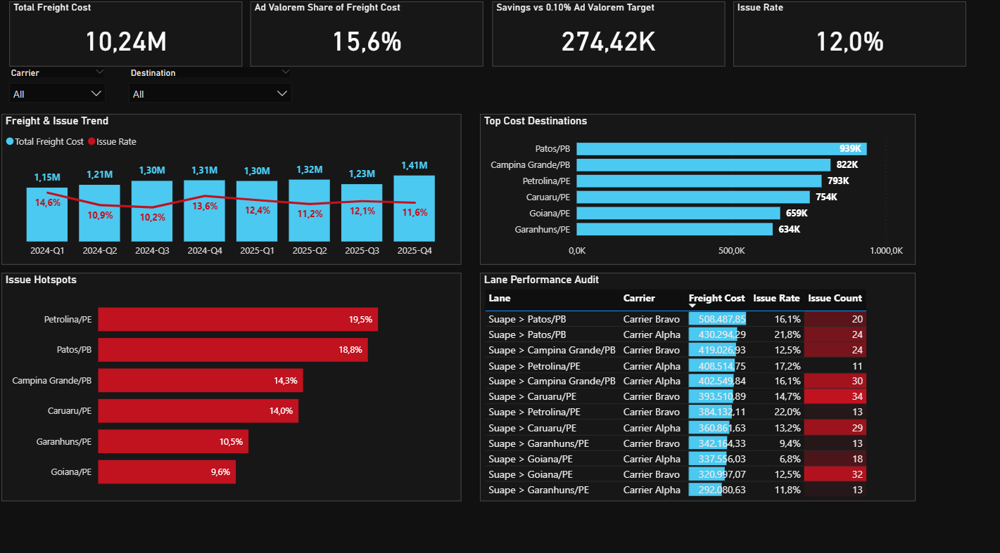
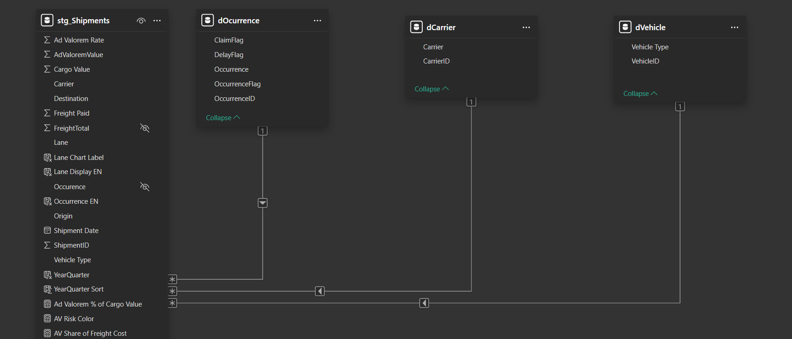

# Freight Cost & Risk Analytics


This is a Power BI model I developed to reverse-engineer freight costs and simulate savings across logistics operations. The goal was to move away from static reporting and create a dynamic tool to challenge carrier SLAs and Ad Valorem taxes.



## Why I Built This

In supply chain operations, Ad Valorem (cargo risk tax) is often treated as a fixed, undisputed cost. Without a granular view linking freight spend to actual operational issues (delays, claims), it is impossible to know if you are paying a premium for risk on routes that don't justify it. 

I built this dashboard to expose those inefficiencies. By simulating a benchmark Ad Valorem cap across the active logistics base, the model immediately identified **R$ 274k in potential savings**. 

Simultaneously, the cross-filtering logic maps operational risk hotspots. For example, it isolated the `Petrolina/PE` lane as having a 19.5% issue rate—the highest among main freight destinations—giving leadership concrete data to renegotiate carrier contracts.

## Data Architecture

The underlying structure is a standard Star Schema to ensure high-performance DAX evaluations.



*   **Fact Table (`stg_Shipments`):** Contains the granular lane data, costs, and cargo values.
*   **Dimensions (`dCarrier`, `dVehicle`, `dOccurrence`):** Standardized categorical data allowing for accurate slicing without impacting model performance.

### DAX Logic Example

Instead of relying on basic aggregations, the engine uses dynamic measures to calculate the savings simulation. Here is the core logic I used to benchmark the Ad Valorem target:

```dax
Savings vs 0.10% Ad Valorem Target = 
VAR TargetRate = 0.001 -- 0.10% Benchmark
VAR CurrentAdValoremValue = SUM(stg_Shipments[AdValoremValue])
VAR TargetAdValoremValue = SUM(stg_Shipments[Cargo Value]) * TargetRate
VAR PotentialSavings = CurrentAdValoremValue - TargetAdValoremValue

RETURN
IF(PotentialSavings > 0, PotentialSavings, 0)

## Exploring the Model

Click the image below to watch a full walkthrough of the dashboard's interactive features.

[](https://github.com/lucas-carvalho-analytics/freight-cost-risk-analytics/blob/main/freight-cost-risk-dashboard-demo.mp4)

To explore the data model, DAX measures, and UI choices directly, download the `.pbix` file and open it in Power BI Desktop.
